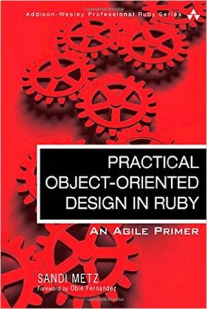

---

Practical Object-Oriented Design in Ruby

---

# Chapter 1

## Object Oriented Design

This book is about designing object-oriented software, and its views the world as a series of spontaneous interactions between objects.

* The world is procedural.
* The world is also object-oriented.
* In a world of objects, new arrangements of behaviour emerge naturally.

---

### Subjects
* In Praise of Design
* The Tools of Design
* The Act of Design
* A Brief Introduction to Object Oriented Programming
* Summary

---

#### In Praise of Design
* Design in order to be easy to change and extend.
* Manage dependencies that can tolerate change.
* The purpose of design is to allow you to do design later and its primary goal is to reduce the cost of change.

---

#### The Tools of Design

---

#### The Act of Design

---

#### A Brief Introduction to Object Oriented Programming

---

#### Summary

---

#### Some Related Links

[Homepage](https://www.pearson.com/us/higher-education/program/Metz-Practical-Object-Oriented-Design-in-Ruby-An-Agile-Primer/PGM274206.html)
