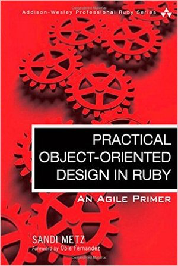

[](https://gitpitch.com/enogrob/ebook-practical-object-oriented-design-in-ruby/master)
```
Roberto Nogueira  
BSd EE, MSd CE
Solution Integrator Experienced - Certified by Ericsson
```
# eBook Practical Object Oriented Design in Ruby



**About**

Learn everything you need to about the subject of this `eBook` project.

[Homepage](https://www.pearson.com/us/higher-education/program/Metz-Practical-Object-Oriented-Design-in-Ruby-An-Agile-Primer/PGM274206.html)

## Topics
```
Table of Contents

[x] Foreword                 xv
[x] Introduction             xvii
[x] Acknowledgments          xxi
[x] About the Author         xxiii

Chapter 1: Object-Oriented Design  1
[x] In Praise of Design   2
[x] The Tools of Design   4
[x] The Act of Design   7
[x] A Brief Introduction to Object-Oriented Programming   11
[x] Summary   14

Chapter 2: Designing Classes with a Single Responsibility   15
[x] Deciding What Belongs in a Class   16
[x] Grouping Methods into Classes   16
[x] Organizing Code to Allow for Easy Changes   16
[x] Creating Classes That Have a Single Responsibility   17
[x] Writing Code That Embraces Change   24
[x] Finally, the Real Wheel   33
[x] Summary   34

Chapter 3: Managing Dependencies   35
[x] Understanding Dependencies   36
[x] Writing Loosely Coupled Code   39
[x] Managing Dependency Direction   51
[x] Summary   57

Chapter 4: Creating Flexible Interfaces   59
[ ] Understanding Interfaces   59
[ ] Defining Interfaces   61
[ ] Public Interfaces   62
[ ] Private Interfaces   62
[ ] Responsibilities, Dependencies, and Interfaces   62
[ ] Finding the Public Interface   63
[ ] Writing Code That Puts Its Best (Inter)Face Forward   76
[ ] The Law of Demeter   80
[ ] Summary   83

Chapter 5: Reducing Costs with Duck Typing   85
[ ] Understanding Duck Typing   85
[ ] Writing Code That Relies on Ducks   95
[ ] Conquering a Fear of Duck Typing   100
[ ] Summary   104

Chapter 6: Acquiring Behavior Through Inheritance   105
[ ] Understanding Classical Inheritance   105
[ ] Recognizing Where to Use Inheritance   106
[ ] Misapplying Inheritance   114
[ ] Finding the Abstraction   116
[ ] Managing Coupling Between Superclasses and Subclasses   129
[ ] Summary 139

Chapter 7: Sharing Role Behavior with Modules   141
[ ] Understanding Roles   142
[ ] Writing Inheritable Code   158
[ ] Summary   162

Chapter 8: Combining Objects with Composition   163
[ ] Composing a Bicycle of Parts   164
[ ] Composing the Parts Object   168
[ ] Manufacturing Parts   176
[ ] The Composed Bicycle   180
[ ] Deciding Between Inheritance and Composition   184
[ ] Summary   190

Chapter 9: Designing Cost-Effective Tests   191
[ ] Intentional Testing   192
[ ] Testing Incoming Messages   200
[ ] Testing Private Methods   213
[ ] Testing Outgoing Messages   215
[ ] Testing Duck Types   219
[ ] Testing Inherited Code   229
[ ] Summary 240

[ ] Afterword   241

[ ] Index   243
```
